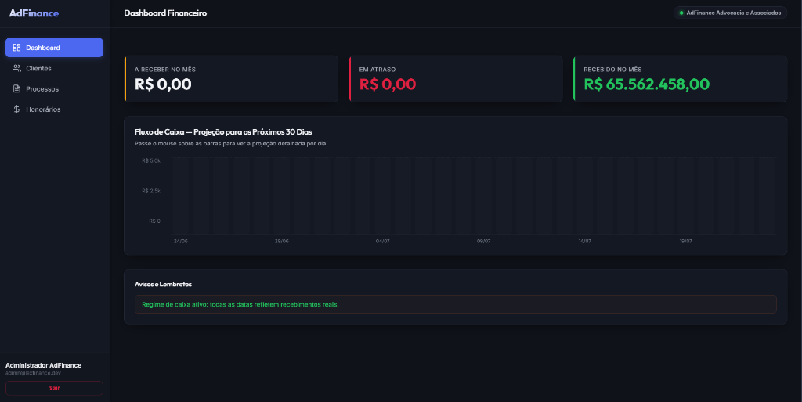
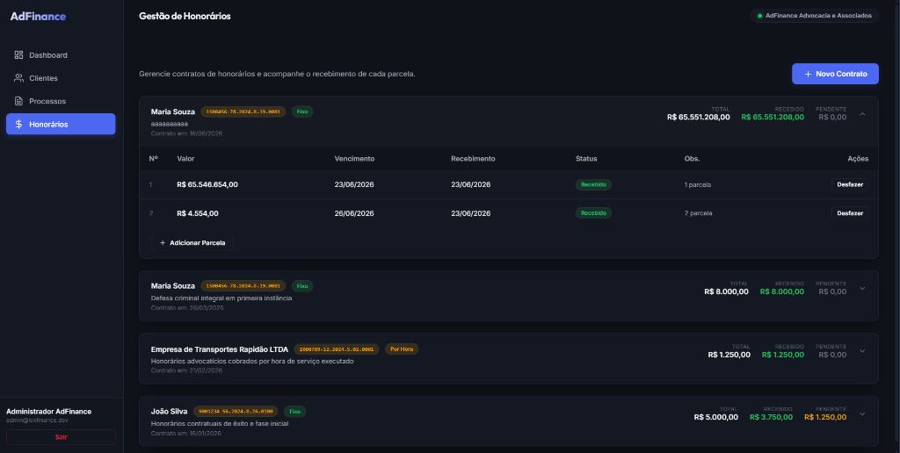

# AdFinance 💼

**Sistema de gestão financeira para escritórios de advocacia.**  
Controle seus clientes, processos judiciais, contratos de honorários e acompanhe o fluxo de caixa em tempo real.

---

## 📸 Interface

### Dashboard Financeiro


### Gestão de Honorários


---

## 🚀 Como rodar o projeto

### Pré-requisitos

| Ferramenta | Versão mínima |
|---|---|
| Java (JDK) | 17+ |
| Maven | 3.8+ |
| Node.js | 18+ |
| npm | 9+ |
| PostgreSQL | 14+ |

---

### 1. Clone o repositório

```bash
git clone https://github.com/Keymiuz/Financial-Dashboard.git
cd Financial-Dashboard
```

---

### 2. Configure o banco de dados

Crie um banco PostgreSQL local:

```sql
CREATE DATABASE adfinance;
```

Edite o arquivo `lexfinance-backend/src/main/resources/application.properties` com suas credenciais:

```properties
spring.datasource.url=jdbc:postgresql://localhost:5432/adfinance
spring.datasource.username=SEU_USUARIO
spring.datasource.password=SUA_SENHA
```

O banco será configurado automaticamente pelo Flyway na primeira execução (migrações em `src/main/resources/db/migration`).

---

### 3. Inicie o backend (Spring Boot)

```bash
cd lexfinance-backend
mvn spring-boot:run
```

O servidor sobe em `http://localhost:8080`.

---

### 4. Inicie o frontend (Angular)

Em outro terminal:

```bash
cd frontend
npm install
npm start
```

A aplicação abre em `http://localhost:4200`.

---

### 5. Faça login

Acesse `http://localhost:4200` e entre com as credenciais de desenvolvimento:

| Campo | Valor |
|---|---|
| **E-mail** | `admin@lexfinance.dev` |
| **Senha** | `admin123` |

---

## 🗂️ Funcionalidades

### 📊 Dashboard
- Cards com **A Receber no Mês**, **Em Atraso** e **Recebido no Mês**
- Gráfico de barras com **Fluxo de Caixa — Projeção para os Próximos 30 Dias**
- **Avisos e Lembretes** automáticos para parcelas em atraso
- Atualizado em tempo real sempre que você navega de volta para a tela

### 👥 Clientes
- Cadastro de **Pessoas Físicas (PF)** e **Pessoas Jurídicas (PJ)**
- Campos: Nome, CPF/CNPJ, Telefone, E-mail, Endereço
- Busca e listagem paginada

### ⚖️ Processos
- Cadastro de processos judiciais com número **CNJ**
- Vinculação ao cliente responsável
- Campos: Área do direito, Status, Descrição, Data de início

### 💰 Honorários
- Criação de **contratos de honorários** vinculados a processos
- Suporte a dois tipos de contrato: **Fixo** e **Por Hora**
- Gerenciamento de **parcelas** por contrato:
  - Adicionar parcelas com valor e data de vencimento
  - **Marcar parcela como Recebida** (com data de recebimento)
  - **Desfazer recebimento** de uma parcela
- Resumo financeiro por contrato: **Total / Recebido / Pendente**
- Status automático: `Pendente`, `Recebido`, `Atrasado`

---

## 🏗️ Arquitetura

```
Financial-Dashboard/
├── frontend/               # Angular 17+ (standalone components)
│   └── src/app/
│       ├── features/       # Telas: dashboard, clientes, processos, honorarios
│       ├── layout/         # Sidebar + Header (main-layout)
│       └── core/           # Auth guard, serviços HTTP, interceptors
│
└── lexfinance-backend/     # Spring Boot 3 + PostgreSQL
    └── src/main/java/com/lexfinance/
        ├── auth/           # JWT autenticação e autorização
        ├── cliente/        # CRUD de clientes
        ├── processo/       # CRUD de processos
        ├── honorario/      # Contratos e parcelas de honorários
        ├── dashboard/      # Resumo financeiro e fluxo de caixa
        └── config/         # Multi-tenancy, segurança, exceções globais
```

### Tecnologias

**Backend**
- Java 17 + Spring Boot 3
- Spring Security + JWT
- Spring Data JPA + Hibernate (multi-tenancy por `tenant_id`)
- PostgreSQL + Flyway (migrações)
- Lombok + MapStruct

**Frontend**
- Angular 17 (standalone components)
- Angular Router + HTTP Client
- Vanilla CSS com design system próprio (dark mode)

---

## 🔐 Multi-tenancy

O sistema suporta múltiplos escritórios de advocacia isolados no mesmo banco de dados. Cada usuário pertence a um **tenant** (escritório), e todos os dados (clientes, processos, honorários) são filtrados automaticamente pelo `tenant_id` via Hibernate.

---

## 🐛 Problemas comuns

**Token JWT expirado ao reabrir o app:**
```javascript
// Execute no console do navegador (F12):
localStorage.removeItem('token');
location.reload();
```
Depois faça login novamente.

**Porta 8080 em uso:**  
Edite `lexfinance-backend/src/main/resources/application.properties` e altere `server.port=8080` para outra porta.

**Banco não conecta:**  
Verifique se o PostgreSQL está rodando e se o nome do banco, usuário e senha em `application.properties` estão corretos.
